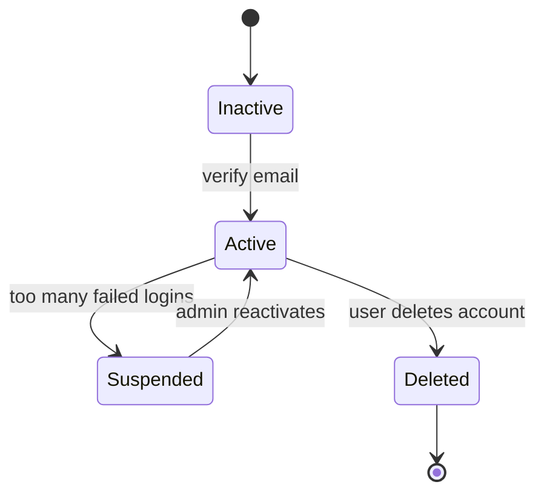
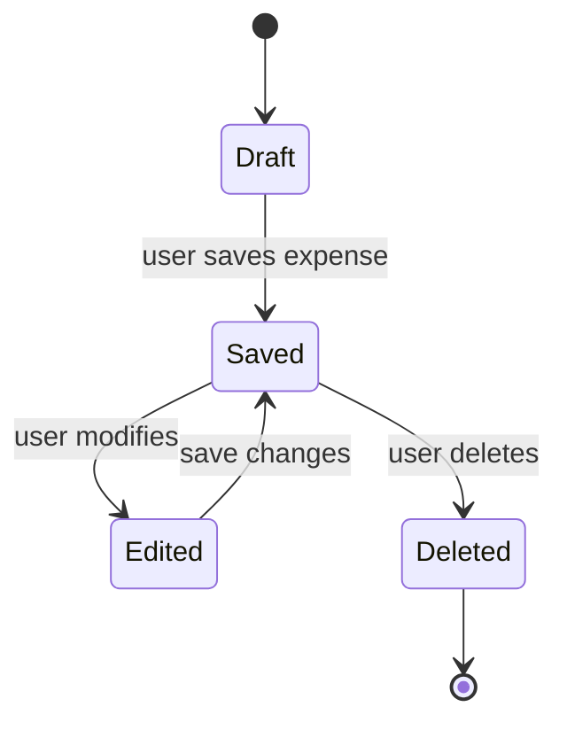
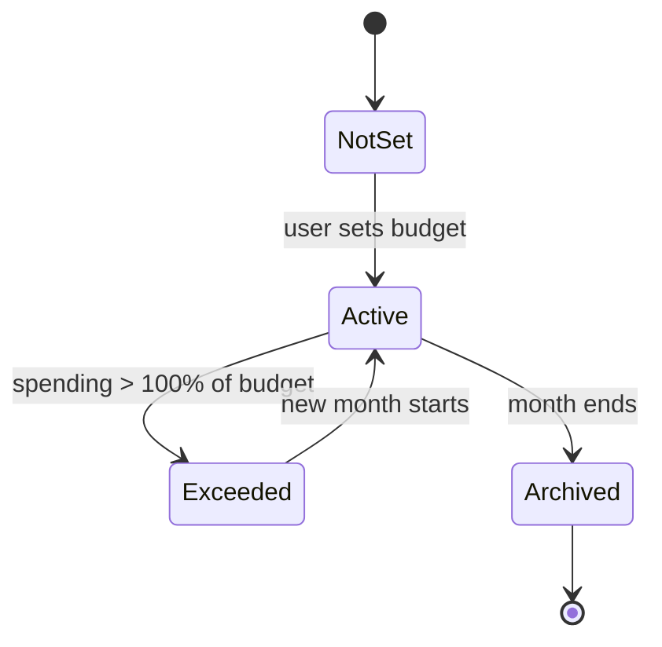
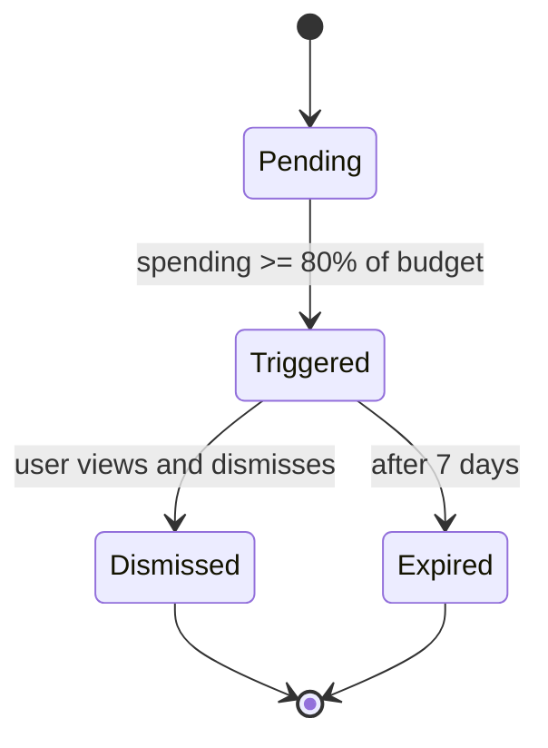
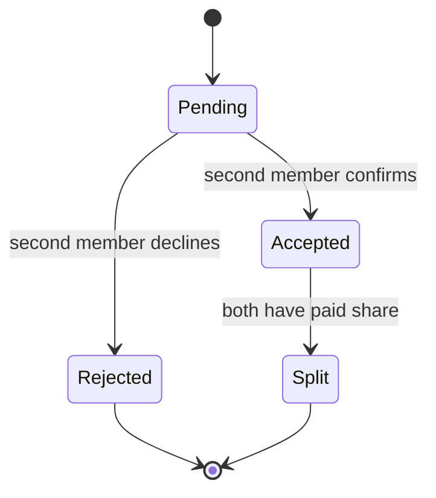
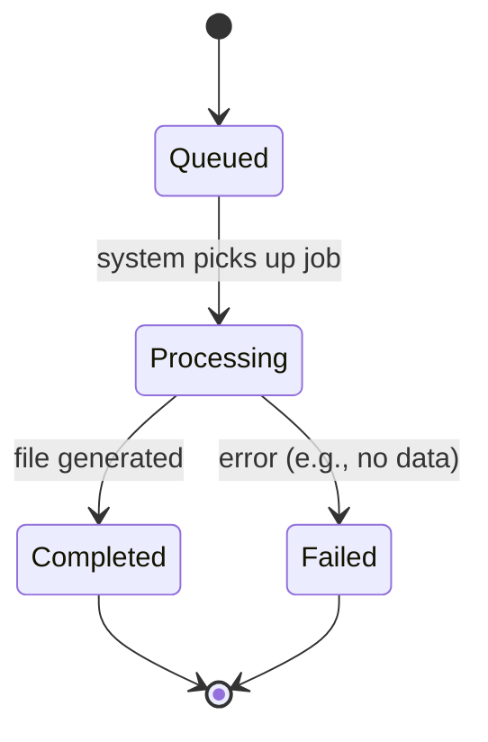
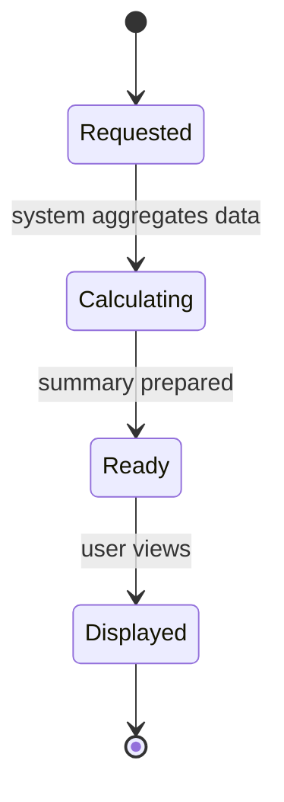

# State Transition Diagrams – Personal Expense Tracker

This document describes the lifecycle of 8 critical objects in the system using UML state transition diagrams. All monetary values are in South African Rand (ZAR).

## 1. User Account

**Explanation:**  
This diagram shows the lifecycle of a user account. A new account starts as *Inactive* until the user verifies their email. Once verified, the account becomes *Active*. If the user enters incorrect login details too many times, the account is *Suspended*. An administrator can reactivate it back to *Active*. If the user chooses to delete their account, it moves to *Deleted* and the process ends.

---

## 2. Expense

**Explanation:**  
This diagram represents how an expense is created and managed. An expense begins as a *Draft* before being saved. Once saved, it becomes *Saved*. If the user makes changes, it moves to *Edited*. After saving again, it returns to *Saved*. If the user removes the expense, it transitions to *Deleted* and ends.

---

## 3. Budget

**Explanation:**  
This diagram shows how a budget behaves over time. Initially, no budget exists (*NotSet*). Once the user creates one, it becomes *Active*. If spending exceeds the budget, it moves to *Exceeded*. At the start of a new month, the budget resets back to *Active*. When the month ends, the budget is *Archived* and no longer active.

---

## 4. Category
```mermaid
stateDiagram-v2
    [*] --> Default
    Default --> Custom : user creates custom category
    Custom --> Archived : user deactivates
    Archived --> Custom : user reactivates
    Custom --> Deleted : user deletes (no expenses linked)
    Deleted --> [*]
```
**Explanation:**  
This diagram represents expense categories. The system starts with *Default* categories (e.g., Food, Transport). Users can create *Custom* categories. These can be temporarily disabled (*Archived*) and later restored. A custom category can only be *Deleted* if it is not linked to any expenses.

---

## 5. Alert

**Explanation:**  
This diagram shows how budget alerts work. Alerts start as *Pending*. When spending reaches a threshold (e.g., 80%), the alert is *Triggered*. The user can acknowledge it, moving it to *Dismissed*. If ignored, it automatically becomes *Expired* after a certain time.

---

## 6. Shared Expense

**Explanation:**  
This diagram represents shared expenses between users. A shared expense starts as *Pending* while waiting for confirmation. If the second user agrees, it becomes *Accepted* and later *Split* when both parties pay their share. If declined, it moves to *Rejected* and ends.

---

## 7. Export Job

**Explanation:**  
This diagram shows how exporting data works. When a user requests an export, the job is *Queued*. The system processes it (*Processing*). If successful, it becomes *Completed*. If something goes wrong (e.g., no data available), it moves to *Failed*.

---

## 8. Monthly Summary

**Explanation:**  
This diagram shows how monthly summaries are generated. When a user requests a summary, it enters the *Requested* state. The system processes the data (*Calculating*). Once ready, it moves to *Ready*. When the user views it, it becomes *Displayed* and completes the cycle.
