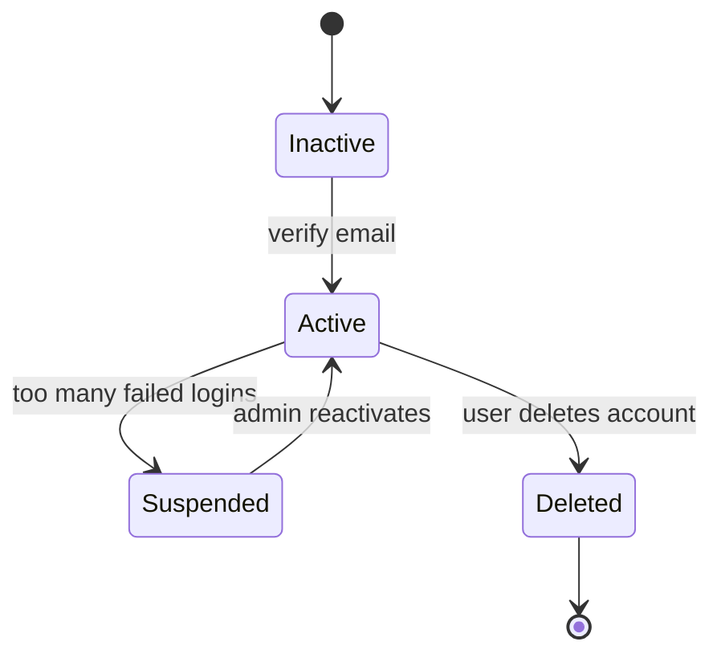

# State Transition Diagrams – Personal Expense Tracker

This document describes the lifecycle of 8 critical objects in the system using UML state transition diagrams. All monetary values are in South African Rand (ZAR).

## 1. User Account



---
```mermaid
stateDiagram-v2
    [*] --> Draft
    Draft --> Saved : user saves expense
    Saved --> Edited : user modifies
    Edited --> Saved : save changes
    Saved --> Deleted : user deletes
    Deleted --> [*]
