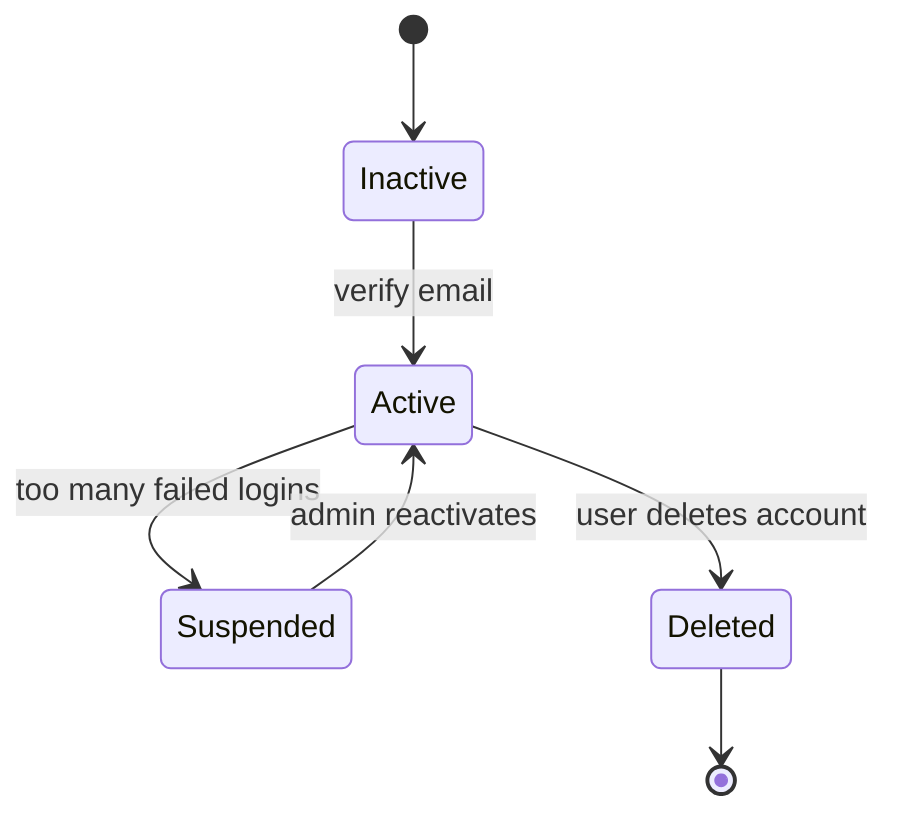
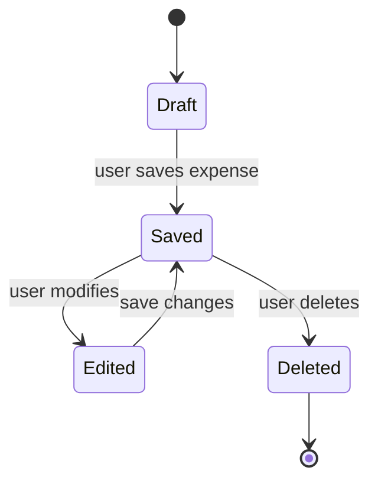

# State Transition Diagrams – Personal Expense Tracker

This document describes the lifecycle of 8 critical objects in the system using UML state transition diagrams. All monetary values are in South African Rand (ZAR).

## 1. User Account

---
Explanation:

States: Draft (unsaved), Saved (persisted), Edited (modified but not saved), Deleted (removed).

Events: save, edit, delete. Guard: amount must be > 0 ZAR.

Maps to: FR-03 (add expense), FR-04 (edit/delete).

---

