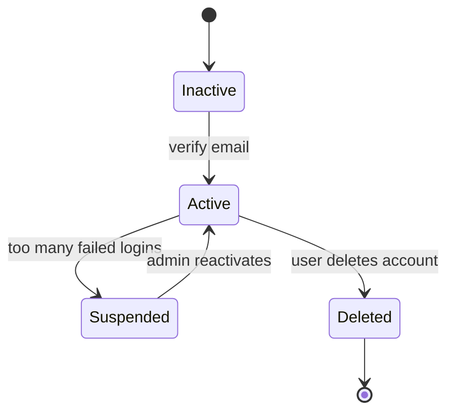
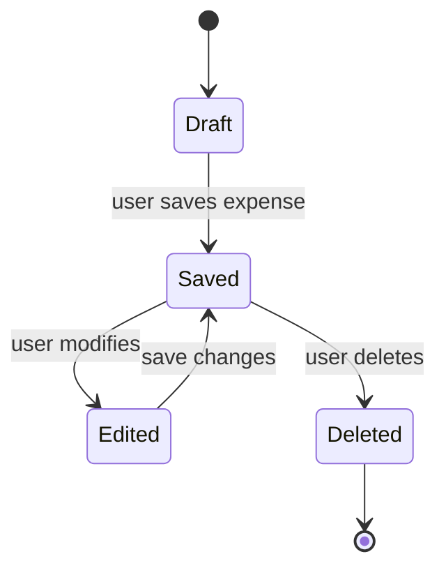
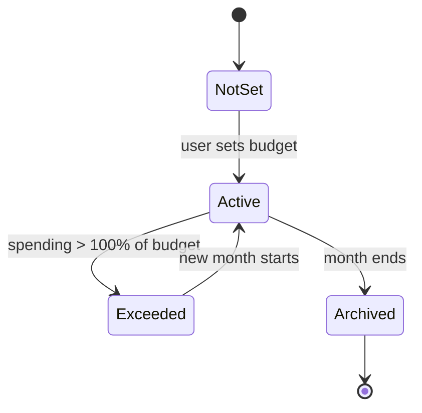

# State Transition Diagrams – Personal Expense Tracker

This document describes the lifecycle of 8 critical objects in the system using UML state transition diagrams. All monetary values are in South African Rand (ZAR).

## 1. User Account



---
Explanation:

States: Draft (unsaved), Saved (persisted), Edited (modified but not saved), Deleted (removed).

Events: save, edit, delete. Guard: amount must be > 0 ZAR.

Maps to: FR-03 (add expense), FR-04 (edit/delete).



---
Explanation:

States: NotSet, Active (within limit), Exceeded (overspent), Archived (past month).

Guard condition: Transition to Exceeded only when total spending > budget amount.

Maps to: FR-07 (set budget), FR-08 (budget alert).



---
Explanation:

States: Default (system-provided, e.g., Food, Transport), Custom (user-defined), Archived (hidden but not deleted), Deleted (permanently removed).

Guard condition: Deletion only allowed if no expenses use that category.

Maps to: FR-11 (manage categories).

```mermaid
stateDiagram-v2
    [*] --> Default
    Default --> Custom : user creates custom category
    Custom --> Archived : user deactivates
    Archived --> Custom : user reactivates
    Custom --> Deleted : user deletes (no expenses linked)
    Deleted --> [*]
    ```

---
Explanation:

States: Pending (not yet triggered), Triggered (alert active), Dismissed (user acknowledged), Expired (auto‑cleared).

Event: budget threshold reached.

Maps to: FR-08 (receive budget alert).
```mermaid
stateDiagram-v2
    [*] --> Pending
    Pending --> Triggered : spending >= 80% of budget
    Triggered --> Dismissed : user views and dismisses
    Dismissed --> [*]
    Triggered --> Expired : after 7 days
    Expired --> [*]
  ```

---
    Explanation:

States: Pending (awaiting confirmation), Accepted (agreed), Rejected (disagreed), Split (each member’s share recorded).

Maps to: FR-12 (shared expenses), stakeholder concern for family members.
```mermaid
stateDiagram-v2
    [*] --> Pending
    Pending --> Accepted : second member confirms
    Pending --> Rejected : second member declines
    Accepted --> Split : both have paid share
    Rejected --> [*]
    Split --> [*]
     ```

---
Explanation:

States: Queued (request received), Processing (generating CSV), Completed (file ready), Failed (error).

Maps to: FR-09 (export expenses), non‑functional performance requirement
```mermaid
stateDiagram-v2
    [*] --> Queued
    Queued --> Processing : system picks up job
    Processing --> Completed : file generated
    Processing --> Failed : error (e.g., no data)
    Completed --> [*]
    Failed --> [*]
     ```

---
Explanation:

States: Requested (user selects month), Calculating (aggregation in progress), Ready (data stored in cache), Displayed (shown as pie chart).

Maps to: FR-06 (view monthly summary).
```mermaid
stateDiagram-v2
    [*] --> Requested
    Requested --> Calculating : system aggregates data
    Calculating --> Ready : summary prepared
    Ready --> Displayed : user views
    Displayed --> [*]
